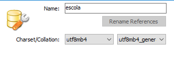

# API-REST

API Rest para estudo.

## Sumário

- [Sobre o Projeto](#sobre-o-projeto)
- [Tecnologias Utilizadas](#tecnologias-utilizadas)
- [Como Usar](#como-usar)

## Sobre o Projeto

Este projeto é uma API REST desenvolvida para estudar como é feito o desenvolvimento de uma API. A API foi construída utilizando Node.js.

### Endpoints Principais

- `GET /api/resource` - Retorna uma lista de recursos.
- `GET /api/resource/{id}` - Retorna um recurso específico por ID.
- `POST /api/resource` - Cria um novo recurso.
- `PUT /api/resource/{id}` - Atualiza um recurso existente.
- `DELETE /api/resource/{id}` - Deleta um recurso existente.

## Tecnologias Utilizadas

- [Linguagem de Programação] - Node.js
- [Framework] - Express
- [Banco de Dados] - MySQL

## Arquivos de configuração

`.sequelizerc` - Arquivo de configuração do Sequelize

    sequelize cli - interface de linha de comando para gerenciar as bases de dados e as migrations

    Caminho do arquivo de configuração:

    ```javascript
    {
      config: resolve(__dirname, 'src', 'config', 'database.js')
    }
    ```

    Caminho dos Models

    ```javascript
    {
      'models-path': resolve(__dirname, 'src', 'models'),
    }
    ```

    Caminho da Migrations

    >Obs.: Essas migrations vão ser alterações na base de dados, por exemplo, ao criar uma tabela o sequelize cria um tipo de histórico de alterações da base de dados.

    ```javascript
    {
      'migrations-path': resolve(__dirname, 'src', 'database', 'migrations'),
    }
    ```

    Caminho dos Seeders:

    ```javascript
    {
      'seeders-path': resolve(__dirname, 'src', 'database', 'seeds'),
    }
    ```

## Banco de dados

O banco de dados foi criado com o MySQL Workbench, caso possua a conta no Google Cloud com um servidor Linux remoto, crie uma nova conexão com o IP estático do servidor remoto, assim poderá criar a base de dados diretamente nele. Caso não tenha um servidor remoto, crie na conexão local.

No MySQL Workbench crie um novo Schema com as seguintes configurações:



O banco de dados será gerenciado através do sequelize, que é **...**

Inatalações:

```shell
npm i sequelize mariadb
npm i -D sequelize-cli
```

### Migrations

Para criar a primeira migration execute a linha de comando:

```shell
npx sequelize migration:create --name=alunos
```

Esso comando vai criar um arquivo na pasta database/migrations, conforme configuração prévia. Esse arquivo vai conter as configurações das tabelas do banco de dados.

Para executar uma migration e fazer ela refletir no banco de dados real, execute:

```shell
npx sequelize db:migrate
```

Para deesfazer uma migração execute:

```shell
npx sequelize db:migrate:undo
```

Em um sistema real diversas migrations serão criadas, porque a cada alteração necessária na tabela deverá ser criada uma migration para tal. Por isso também é importante dar atenção aos nomes de cada migration, para não criar nomes muito generalistas e correr o risco de não conseguir identificar uma migration posteriormente.

Por exemplo, a migration a seguir foi criada para alterar o _email_ do `Aluno` para `unique`:

```shell
npx sequelize migration:create --name=mudar-email-aluno-unique
```

### Seeds

Essas seed podem ser usadas para inserir dados ficticios no banco de dados para testes.

Para criar uma nova seed no caminho configurado no sequelize, execute:

```shell
npx sequelize seed:generate --name criar-usuarios
```

Para inserir os dados da seed no banco de dados:

```shell
npx sequelize db:seed:all
```

## Requisições

- **INDEX** -> Lista todos os usuários: `GET`
- **STORE/CREATE** -> Cria um novo usuário: `POST`
- **DELETE** -> Apaga um usuário: `DELETE`
- **SHOW** -> Mostra um usuário: `GET`
- **UPDATE** -> Atualiza um usuário: `PATCH`(_só um valor_) ou `PUT`(_objeto inteiro_)

Se o seu controller faz mais do que esse métodos, é possível que você esteja fazendo mais do que o padrão nesse controller e deveria criar outro controller para esses métodos extras.

## Middlewares

### loginRequired

Essa rota de middleware vai fazer a interceptação das requisições e verificar se o token de autenticação está sendo transmitido pelo cliente.

Em uma requisição HTTP o token de autenticação pode ser passado de duas maneisa:

_Auth_ - Basta passar o token;
_Header_ - É necessário transmitir através de uma chave `authorization` com o valor `Bearer {TOKEN}`;

## Upload de arquivos

Para fazer upload da foto do aluno foi utilizada a biblioteca `multer`:

```shell
npm i multer
```

Foi criada uma rota específica para receber qualquer tipo de arquivo `_base_url/fotos/`.

Na pasta config foi criado o arquivo de configuração do multer:
